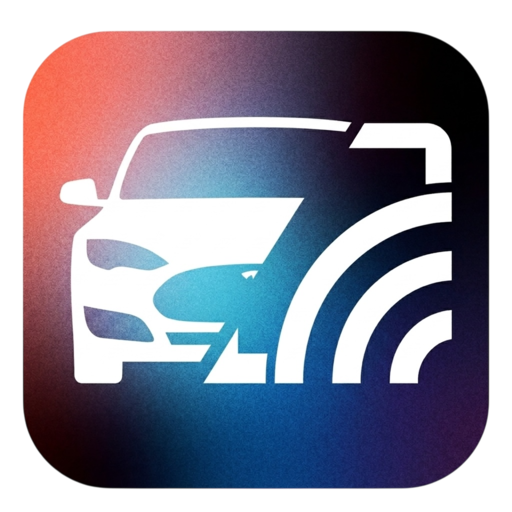
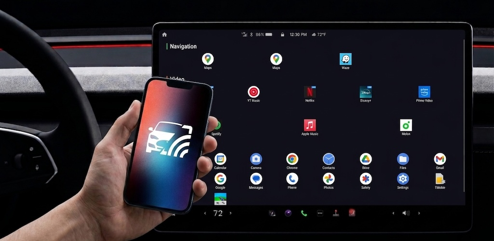

  
  <h1 align="center">Castla</h1>
  

    <strong>Die ultimative Android Auto Alternative für Tesla. Waze, Google Maps und dein Handy-Display direkt im Tesla-Browser.</strong>
  

  

    
    
    
  

  

    <a href="README.md">English</a> · <a href="README.ko.md">한국어</a> · <a href="README.ja.md">日本語</a> · <a href="README.zh-CN.md">中文</a> · <a href="README.es.md">Español</a> · <a href="README.fr.md">Français</a>
  

  

---

## Was ist Castla?

Vermisst du **Android Auto** in deinem Tesla? Willst du **Waze** oder Google Maps auf dem großen Bildschirm nutzen?

Castla ist eine kostenlose Open-Source-Lösung, die den Bildschirm deines Android-Handys direkt über das lokale WiFi-Netzwerk auf den integrierten Browser deines Teslas streamt. Keine Internetverbindung, keine teuren Dongles, keine Cloud-Server, keine Abonnements — alles bleibt schnell, sicher und ausschließlich zwischen deinem Handy und deinem Auto.

**Hauptmerkmale:**

- **Android Auto Erlebnis** — Nutze deine Lieblings-Navi- und Musik-Apps auf dem Tesla-Display
- **Echtzeit-Mirroring** — H.264 Hardware-Encoding + WebSocket-Streaming für ultra-niedrige Latenz
- **Volle Touch-Steuerung** — Tippe, wische und interagiere direkt vom Tesla-Bildschirm (über Shizuku)
- **Audio-Streaming** — Geräteaudio direkt auf Tesla-Lautsprecher streamen (Android 10+)
- **100% lokal & privat** — Alle Daten bleiben im WiFi/Hotspot
- **Komplett kostenlos** — Keine Werbung, keine Paywalls. Open Source unter Apache-2.0

## Funktionen

| Funktion | Details |
|----------|---------|
| **Navigation auf dem großen Bildschirm** | **Waze**, Google Maps und jede App flüssig bis 1080p @ 60fps |
| **Touch-Eingabe** | Volle Touch-Injektion via Shizuku. Handy vom Autobildschirm steuern |
| **Geteilte Ansicht** | Dual-Panel-Multitasking. Links Waze, rechts YouTube! |
| **Virtuelles Display** | Apps unabhängig auf Tesla ausführen, ohne Handy-Bildschirm eingeschaltet |
| **Audio** | System-Audio-Capture (Android 10+, experimentell) |
| **Tesla Auto-Erkennung** | BLE + Hotspot-Client-Erkennung für automatische Verbindung |
| **Auto-Hotspot** | Hotspot automatisch ein/aus beim Start/Stop des Mirrorings |
| **OTT-Browser** | Integrierter Browser für DRM-Inhalte (YouTube, Netflix, etc.) |
| **Wärmeschutz** | Automatische Qualitätsreduzierung bei Überhitzung |
| **9 Sprachen** | EN, KO, DE, ES, FR, JA, NL, NO, ZH |

## Voraussetzungen

- Android 8.0+ (API 26)
- [Shizuku](https://shizuku.rikka.app/) für Touch-Steuerung und erweiterte Funktionen
- Tesla-Fahrzeug mit Webbrowser
- Handy und Tesla im selben WiFi-Netzwerk (oder Handy-Hotspot)

## Installation

1. Gehe zu [Releases](https://github.com/Suprhimp/castla/releases/latest)
2. Lade die neueste `.apk`-Datei herunter
3. Installiere sie auf deinem Android-Gerät

## Schnellstart

1. **Shizuku installieren** — Öffne Castla, tippe auf „Shizuku installieren"
2. **Shizuku starten** — Entwickleroptionen → Kabelloses Debugging → Shizuku öffnen → „Über Kabelloses Debugging starten"
3. **Berechtigung erteilen** — Erlaube Castla die Nutzung von Shizuku
4. **Verbinden** — Stelle sicher, dass Handy und Tesla im selben WiFi sind
5. **Mirroring starten** — Tippe in Castla auf „Mirroring starten"
6. **Im Tesla öffnen** — Gib die angezeigte URL im Tesla-Browser ein

## Beitragen

Beiträge sind willkommen! Details im [Contributing Guide](CONTRIBUTING.md).

## Datenschutz

Castla sammelt **keinerlei Daten**. Siehe [Datenschutzerklärung](PRIVACY.md).

## Indie-Entwickler unterstützen

## Verwendete Open-Source-Projekte

Castla baut auf großartigen Open-Source-Projekten auf:

- [Shizuku](https://shizuku.rikka.app/) — privilegierter API-Zugriff ohne Root
- [NanoHTTPD](https://github.com/NanoHttpd/nanohttpd) — eingebetteter HTTP-/WebSocket-Server
- [ZXing](https://github.com/zxing/zxing) — QR-Code-Generierung
- [AndroidX / Jetpack Compose](https://developer.android.com/jetpack) — modernes Android-UI-Toolkit
- [Kotlin Coroutines](https://github.com/Kotlin/kotlinx.coroutines) — asynchrone Streaming-Pipeline

Einige Techniken des privilegierten Modus wurden von [scrcpy](https://github.com/Genymobile/scrcpy) (Apache-2.0) inspiriert, insbesondere:

- Physisches Ein-/Ausschalten des Displays über `SurfaceControl` für Bildschirm-aus-Mirroring
- Das `fillAppInfo` / `FakeContext`-Muster zum Spoofing der `AttributionSource` beim Erfassen von System-Audio aus einem Shell-UID-Dienst

Es ist kein scrcpy-Quellcode enthalten — Castla implementiert diese Ansätze eigenständig.

Siehe [NOTICE](NOTICE) für die vollständige Liste der Drittanbieter-Attributionen.

## Lizenz

[Apache License 2.0](LICENSE)
